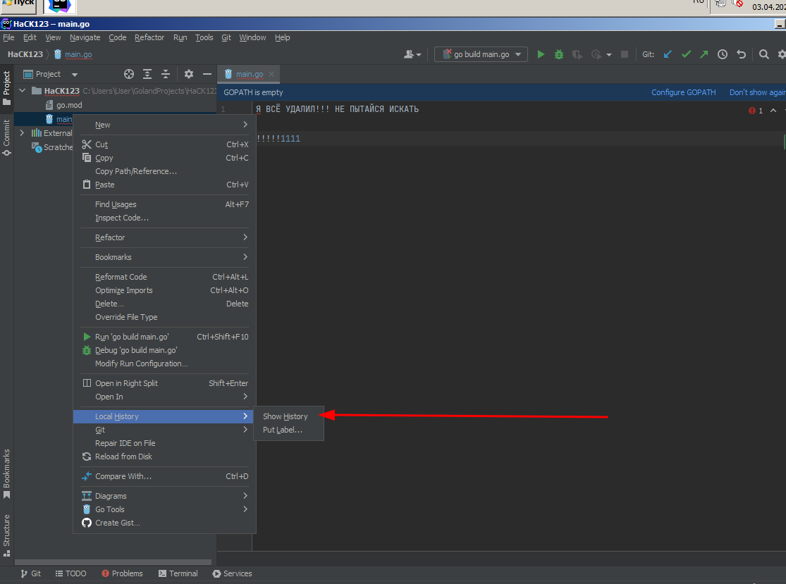

# Название: За семью печатями
#### Флаг: `CTF{m0r3_l0cks_pl3as3!}`


## Описание
Хакер посетил наш ханипот и оставил кое-какую загадку в виде зашифрованного файла. Вероятно, он хочет поиграть с нами в кошки-мышки.
### Ссылки для скачивания образа .ova
https://drive.google.com/file/d/19ozIpXKfjDAmI9gHEu8KsBHZiT-P12mK/view?usp=sharing  
https://mega.nz/file/2yY0HIAB#cfEAbpRSS42HvPsb-mb_5ZqYducKs4TTlzmb-jWW5ts  
Mail Cloud [zip архив с 2 частями]:  
ч.1 https://cloud.mail.ru/public/5q9n/7oWqrEVcd  
ч.2 https://cloud.mail.ru/public/Zt42/Qh7Q3daL3  
Yandex Disk [zip 4 части]:  
ч.1 https://disk.yandex.ru/d/nN8HfNlzKjEoog  
ч.2 https://disk.yandex.ru/d/3XCo7e5gI4BTXw  
ч.3 https://disk.yandex.ru/d/xbFP-4qIwN-1gg  
ч.4 https://disk.yandex.ru/d/ji2zuikkZvpkaQ

## Решение
1) Видим, что на учетке стоит пароль. Сбрасываем с помощью http://pogostick.net/~pnh/ntpasswd/bootdisk.html
2) Теперь видим какое-то беспорядочное мигание и замечаем, что с нас снова требуют какой-то пароль. Пробуем загрузку в безопасном режиме и на рабочем столе обнаруживаем ярлыки "Eusing Maze Lock" и "Desktop Lock Express":  Удаляем эти локеры. Для этого я загрузил Xubuntu Live CD:  и удалил соответствующие папки из "Program Files (x86)" (можно и с винды, но неудобно из-за сбитой темы).
3) Заходим без проблем, видим сбитую тему (очень мешает работе). Сносим её, выбрав другую в настройках "Персонализации" (в безопасном режиме сделать это не могли!): 
4) Результат: 
5) На рабочем столе обнаруживается файл `Flag.txt.encr_hard.encr_easy`. Так же замечаем python-файл шифровальщика (по коду определяем, что это encr_easy, и его нужно "вскрывать" первым из-за того, что он был наложен последним).  
Шифровальщик кодирует каждый байт как md5 хеш, соотв-но обнаруживается уязвимость: байтов всего 256, поэтому легко узнаем их хеши. Пишем декриптор:
```python
import hashlib

hashes = {}
for byte in range(0, 0xFF + 1):
    hashes[hashlib.md5(bytes([byte])).digest()] = byte

with open('file.encr_hard.encr_easy', 'rb') as encf:
    enc_data = encf.read()

with open('file.encr_hard', 'wb') as decf:
    for i in range(16, len(enc_data)+16, 16):
        ddta = enc_data[i - 16:i]
        decf.write(bytes([hashes[ddta]]))
```
6) Приступаем к "hard" шифровальщику. В качестве подсказок к нему оставлены "HACKED Chrome" и "HACKED GoLand" ярлыки. Заходим сначала в Chrome (надо вручную запустить chrome.exe в `Program Files`) и проверяем историю:   
Зачем-то включено логирование параметров запускаемых процессов. Смотрим логи: 
Находим ключ для расшифровки. Также можно заметить запуск Git'a GoLand'ом (но это не обязательно, достаточно просто догадаться до следующей части и без этого): 
7) Запустив Goland, видим "я всё удалил бла-бла-бла", но это нас не останавливает. Можем восстановить код из коммита git. Также во всех IDE от JetBrains есть такая штука, как Local History (история изменения файлов (P.S. на заметку, она работает и без Git)). Я воспользуюсь ей: 
8) Изучив код шифровальщика (стандартный RC4), пишем дешифровальщик (можно просто скопировать функцию шифрования в GPT и получить обратную):
```go
package main

import (
	"crypto/rc4"
	"encoding/hex"
	"flag"
	"os"
)

func DecryptRC4(keyHex string, value []byte) ([]byte, error) {
	// Convert the key and value hex strings to byte arrays
	key, err := hex.DecodeString(keyHex)
	if err != nil {
		return nil, err
	}

	// Create a new RC4 cipher using the key
	cipher, err := rc4.NewCipher(key)
	if err != nil {
		return nil, err
	}

	// Decrypt the value using the RC4 cipher
	decrypted := make([]byte, len(value))
	cipher.XORKeyStream(decrypted, value)

	return decrypted, nil
}

/*func EncryptRC4(keyHex string, value []byte) ([]byte, error) {
	key, err := hex.DecodeString(keyHex)
	if err != nil {
		return nil, err
	}

	cipher, err := rc4.NewCipher(key)
	if err != nil {
		return nil, err
	}
	encrypted := make([]byte, len(value))
	cipher.XORKeyStream(encrypted, value)

	return encrypted, nil
}*/

func main() {
	key := flag.String("key", "", "the key to use for encryption in hex format")
	fname := flag.String("fname", "", "file name for encryption")
	flag.Parse()

	if *key == "" {
		panic("Please specify key")
	}

	if *fname == "" {
		panic("Please specify file to decrypt")
	}

	if len(*key) != 2*20 {
		panic("Bad key length")
	}

	fileContents, _ := os.ReadFile(*fname)
	encrypted, _ := DecryptRC4(*key, fileContents)
	err := os.WriteFile("decry.txt", encrypted, 777)
	if err != nil {
		panic(err)
	}

	println("Success")
}
```
На этом решение заканчивается.